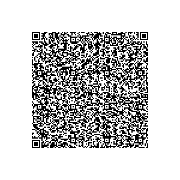

# Kiosk app reference implementation

The app is available at <link to partner repo / github repo> (TODO: bdeepankar)  
Please reach out to your Google poc if you have any questions.

### Get the code

Clone the repo from <insert github link>

### Prepare

We have used Firebase cloud messaging to send lock / unlock commands to the
device, however this is entirely optional. You can implement your logic and use
your preferred service provider for push messaging.  
If you need to simply try out the Kiosk app reference implementation as is, you
need to configure the project as follows:

1. Create a new Firebase project at
    [https://console.firebase.google.com/](https://console.firebase.google.com/)
1.  Add an Android app in your project
    1. The default package name is `com.ape.apps.sample.baypilot`. If
        you are creating your own app, then you might need to refactor the
        package name in Android Studio. Enter the package name in the firebase console.
    1. Select a nickname of your choice.
    1. Register.
    1. Download the generated `google-services.json` file and copy it in
        your project folder as directed in Firebase console / documentation.
    1. Finish the remaining setup. Firebase sdk libraries have already
        been added to the projects.   

1. Turn on Anonymous authentication for your app in Firebase.

### Build

1. From the `bay-pilot` folder, build the kiosk app 

```
./gradlew clean build
```

This will build the apk and output it at
`app/build/outputs/apk/debug/app_debug.apk`

### Deploy

#### Using QR Code

Note: This method does not currently work on Android 12. You will need a
compatible Android 11 userdebug build.

1. Factory reset the device
1. Sideload the kiosk app and dev DLC apk on the device. Contact your Google
    poc for the dev DLC apk.

```
adb install app-debug.apk
adb install devicelock_dev.apk
```

1. Tap anywhere on the screen six times to start the QR code scanner
1. The following is a sample config, for a test QR code:

```
{
  'android.app.extra.PROVISIONING_LEAVE_ALL_SYSTEM_APPS_ENABLED': true,
  'android.app.extra.PROVISIONING_SKIP_EDUCATION_SCREENS': false,
  'android.app.extra.PROVISIONING_ADMIN_EXTRAS_BUNDLE': {
    'com.google.android.apps.devicelock.CREDITOR_PACKAGE': 'com.ape.apps.sample.baypilot',
    'com.google.android.apps.devicelock.CREDITOR_SETUP_ACTIVITY': 'com.ape.apps.sample.baypilot/com.ape.apps.sample.baypilot.ui.welcome.WelcomeActivity',
    'com.google.android.apps.devicelock.CREDITOR_NAME': 'Bay Pilot Creditor',
    'com.google.android.apps.devicelock.CREDITOR_ALLOWLIST_0': 'com.android.chrome',
    'com.google.android.apps.devicelock.EXTRA_CREDITOR_READ_IMEI_ALLOWED': true
  }
}
```

QR Code:  


You can modify the config but make sure to re-generate the QR Code using any QR
Code tool of your choice,

1. Complete the Setup Wizard and you should see the kiosk app setup activity.

#### ZeroTouch

Please contact your Google poc for more information on testing on ZeroTouch.

### Features

The sample Kiosk app demonstrates the following features:

1. Kiosk app Onboarding flow
1. Home screen, with device payment info, upcoming due date, locking status,
    a "pay now" button to redirect to FoP of choice, quick access to settings,
    dialer, refreshing the screen and getting support
1. Locking / Unlocking capabilities
1. Show Notifications per device lock guidelines

### Disclaimer

This is not an official Google project. It is meant to demonstrate
the usage of DLC APIs to partners and help them speed up their kiosk app
development.  
If you plan to incorporate the features demonstrated, please carefully review
the code and proceed at your own risk. See LICENSE.md for terms and conditions.
The code is published under Apache License 2.0. We are currently not accepting
any contributions.
